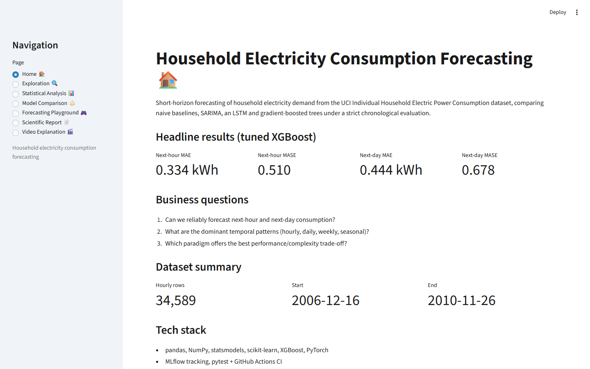
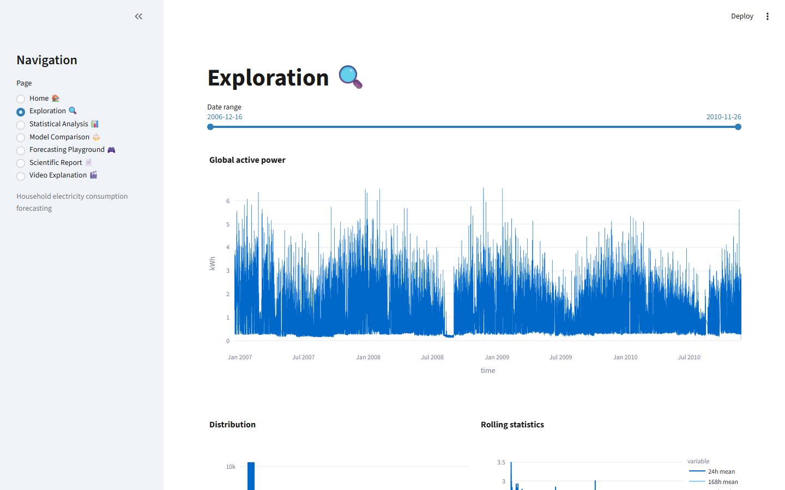
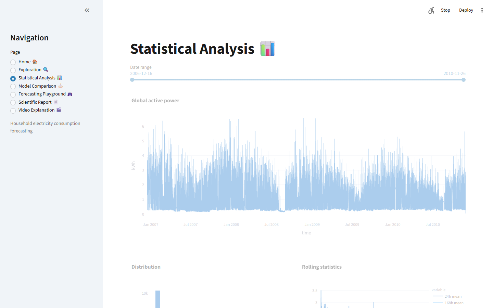
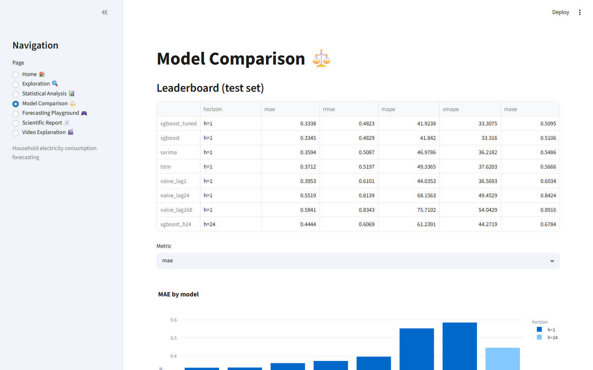
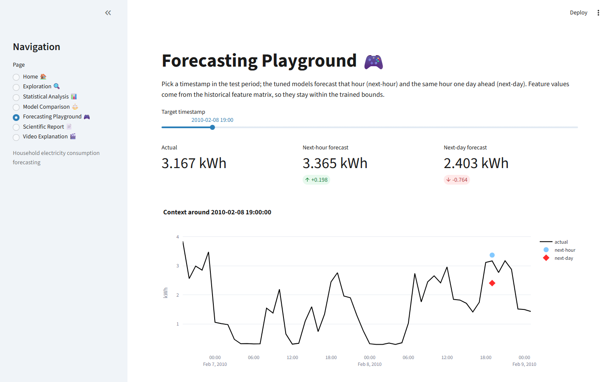
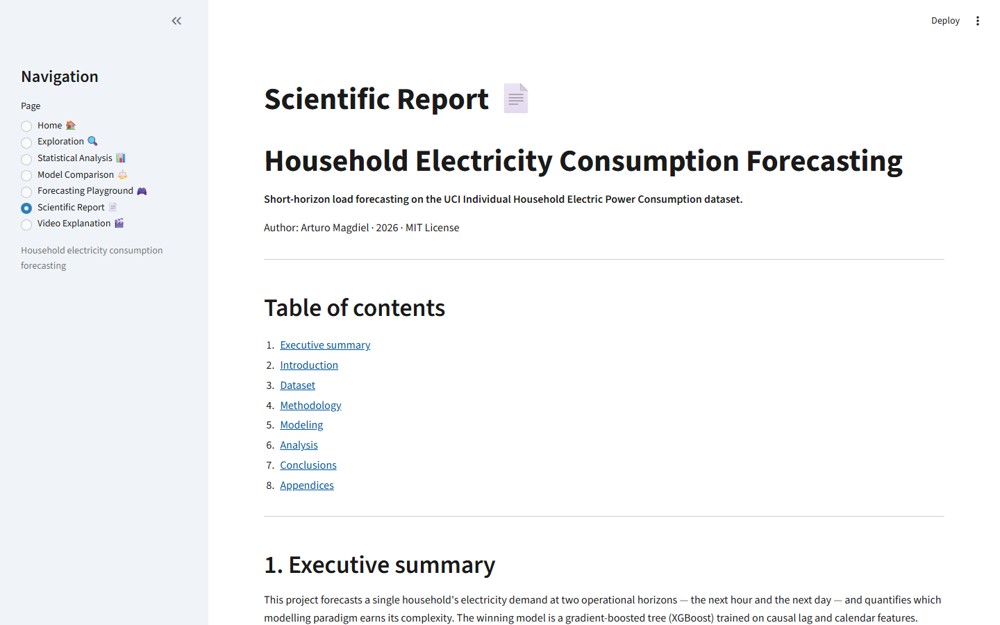
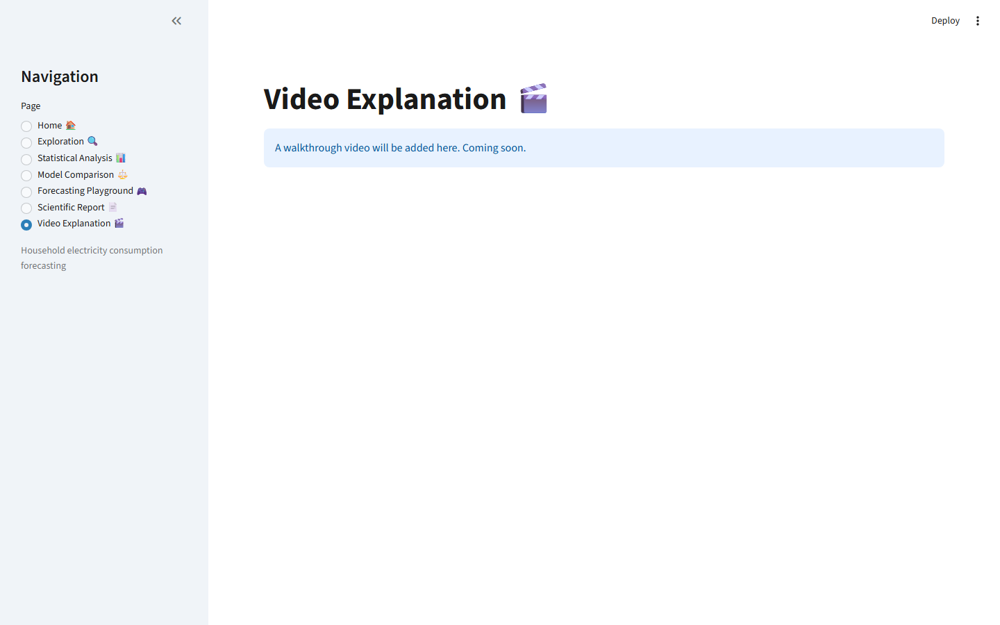

# Household Electricity Consumption Forecasting

Short-horizon (next-hour and next-day) forecasting of household electricity demand on the UCI Individual Household Electric Power Consumption dataset, comparing naive baselines, SARIMA, an LSTM and gradient-boosted trees under a strict chronological evaluation.

[](https://github.com/arturomagdiel666/time-series-forecasting-project/actions/workflows/ci.yml)


**Live dashboard:** `<RAILWAY_URL — add after deploy>`

**Stack:** pandas · scikit-learn · statsmodels · XGBoost · PyTorch · MLflow · Streamlit · Plotly · pytest · GitHub Actions.

---

## 📌 Overview

Accurate short-horizon load forecasting underpins grid balancing, demand-response programmes and household cost optimisation. This project builds and rigorously evaluates a forecaster for a single household, answering three business questions:

1. Can we reliably forecast next-hour and next-day household electricity consumption?
2. What are the dominant temporal patterns (hourly, daily, weekly, seasonal)?
3. Which paradigm — SARIMA, gradient-boosted trees, or an LSTM — offers the best performance-to-complexity trade-off?

## 🔧 Engineering highlights

- **Leakage-safe pipeline** — chronological train/test split, `TimeSeriesSplit` expanding-window cross-validation, and lag/rolling features computed only after the split. Contemporaneous meter channels are excluded because `Global_intensity` is a near-linear proxy of the target.
- **Rigorous evaluation** — MAE-primary alongside RMSE/MAPE/sMAPE/MASE, residual diagnostics, and per-hour/day/month error analysis across 7 models and 2 horizons.
- **Reproducible** — pinned Python 3.12 environment, global seed 42, MLflow experiment tracking, and a 22-test pytest suite that runs in GitHub Actions on synthetic fixtures (never the real dataset).
- **Deployable** — a 7-page Streamlit + Plotly dashboard that serves the serialized model and deploys to Railway from the committed artifacts alone.

## 📊 Key results

The winner is a tuned XGBoost on causal lag and calendar features. Metrics are on the held-out test set (January–November 2010); MAE is primary, MASE is scaled by the lag-24 seasonal-naive error (denominator 0.6551), so MASE < 1 means the model beats "same hour yesterday".

| Horizon | MAE (kWh) | MASE |
|---|---|---|
| Next-hour (h=1) | **0.334** | **0.510** |
| Next-day (h=24) | **0.444** | **0.678** |

**Next-hour test leaderboard:**

| Model | MAE | RMSE | MAPE | sMAPE | MASE |
|---|---|---|---|---|---|
| **xgboost_tuned** | **0.3338** | 0.4823 | 41.92 | 33.31 | 0.5095 |
| xgboost | 0.3345 | 0.4829 | 41.84 | 33.32 | 0.5106 |
| sarima | 0.3594 | 0.5087 | 46.98 | 36.22 | 0.5486 |
| lstm | 0.3712 | 0.5197 | 49.34 | 37.62 | 0.5666 |
| naive_lag1 | 0.3953 | 0.6101 | 44.04 | 36.57 | 0.6034 |
| naive_lag24 | 0.5519 | 0.8139 | 68.16 | 49.45 | 0.8424 |
| naive_lag168 | 0.5841 | 0.8343 | 75.71 | 54.04 | 0.8916 |

The direct next-day (h=24) XGBoost scores MAE 0.4444 / MASE 0.6784 — less accurate than next-hour, as expected, but still well ahead of its seasonal baseline. Hyperparameter tuning moved test MAE only from 0.3345 to 0.3338: on this series, features drive performance, not hyperparameters.

**Hypotheses (all supported):** H1 weekly seasonality (Kruskal-Wallis day-of-week H=239.3, p<1e-40); H2 non-stationary raw, stationary after lag-24 seasonal differencing (ADF/KPSS); H3 trees beat the LSTM in CV (0.378 vs 0.415) and test (0.334 vs 0.371) at a fraction of the compute.

## 🖥️ Dashboard

Seven-page Streamlit + Plotly dashboard reading only committed processed artifacts (no raw dataset required).

| Home | Exploration |
|---|---|
|  |  |

| Statistical Analysis | Model Comparison |
|---|---|
|  |  |

| Forecasting Playground | Scientific Report |
|---|---|
|  |  |

| Video Explanation | |
|---|---|
|  | |

## 📂 Dataset

UCI Machine Learning Repository — *Individual Household Electric Power Consumption* (Sceaux, France), licensed **CC BY 4.0**. 2,075,259 minute-level measurements, December 2006 to November 2010, ~1.25% missing. Aggregated to **34,589 hourly rows** (kWh/hour) for modelling. The raw file is not committed.

## 🗂️ Project structure

```
time_series_forecasting_project/
├── app/dashboard.py            # 7-page Streamlit dashboard
├── data/processed/             # hourly + feature parquets, per-model predictions
├── models/                     # best_model.pkl, best_model_h24.pkl, metadata.json, scaler
├── notebooks/                  # 01_eda.ipynb, 02_modeling.ipynb (executed)
├── reports/                    # report.md, report.pdf, figures/{eda,modeling,dashboard}
├── scripts/                    # data download, training, evaluation, report rendering
├── src/                        # data_loader, cleaning, features, models, metrics, tracking
├── tests/                      # pytest suite on synthetic fixtures
├── .github/workflows/ci.yml    # CI: pytest on push/PR, no real dataset
├── DECISIONS.md · DEPLOYMENT.md
├── requirements.txt · dev-requirements.txt · runtime.txt · Procfile
```

## ⚙️ Setup

Requires Python 3.12. Two paths to obtain the data:

**Option A — manual.** Download the dataset from [Kaggle](https://www.kaggle.com/datasets/uciml/electric-power-consumption-data-set) or [UCI](https://archive.ics.uci.edu/dataset/235/individual+household+electric+power+consumption), unzip, and place `household_power_consumption.txt` at `data/raw/`. Then:

```bash
python -m venv .venv
.venv/Scripts/activate        # Windows;  source .venv/bin/activate on Linux/macOS
pip install -r requirements.txt
```

**Option B — automated.** The loader downloads from Kaggle and verifies the file against a hardcoded SHA-256:

```bash
python -m venv .venv
.venv/Scripts/activate        # Windows;  source .venv/bin/activate on Linux/macOS
pip install -r requirements.txt
python scripts/download_data.py
```

## ▶️ Running

```bash
# Dashboard (reads committed artifacts; no raw data needed)
streamlit run app/dashboard.py

# Tests (synthetic fixtures only, no real dataset)
pip install -r dev-requirements.txt
pytest

# Notebooks
jupyter notebook notebooks/01_eda.ipynb notebooks/02_modeling.ipynb
```

The dashboard and tests run on the committed processed artifacts alone, so a fresh clone runs end to end without the raw dataset.

## 📄 Report and decisions

- Full scientific report: [reports/report.md](reports/report.md) · [reports/report.pdf](reports/report.pdf)
- Methodological decision log: [DECISIONS.md](DECISIONS.md)
- Deployment checklist: [DEPLOYMENT.md](DEPLOYMENT.md)

## 📜 License

MIT License — Copyright (c) 2026 Arturo Magdiel. See [LICENSE](LICENSE).
