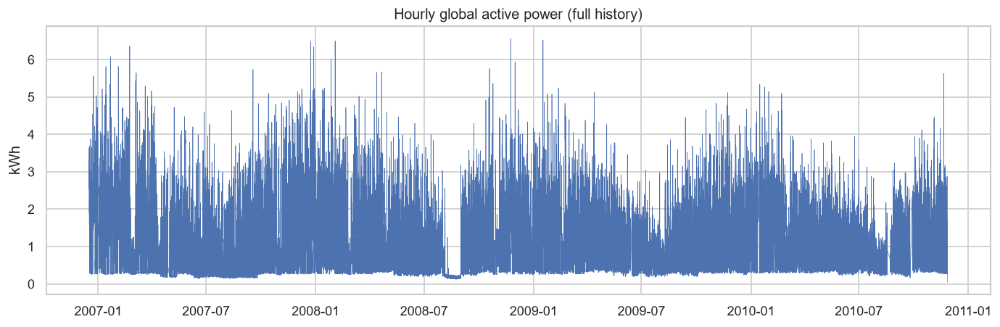
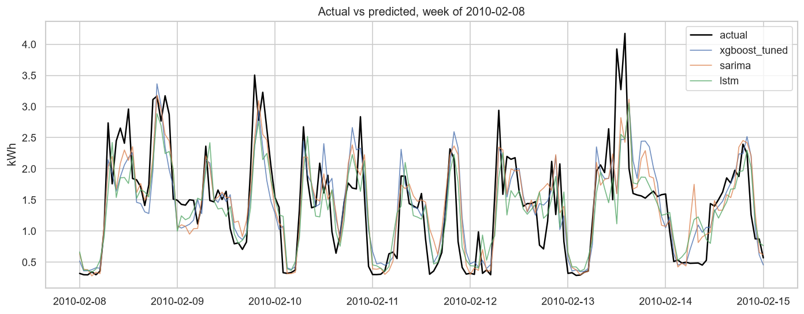
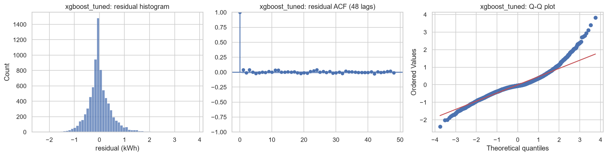
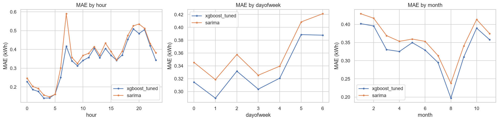
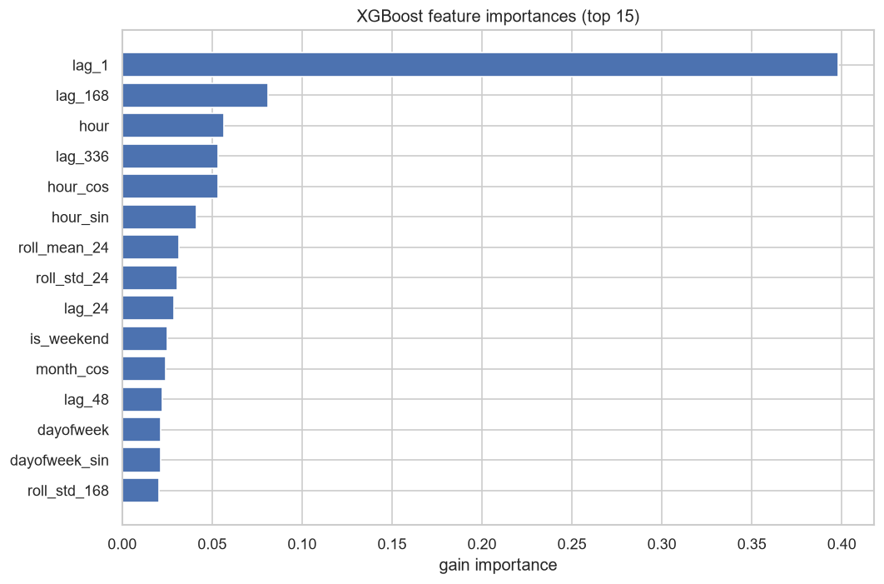
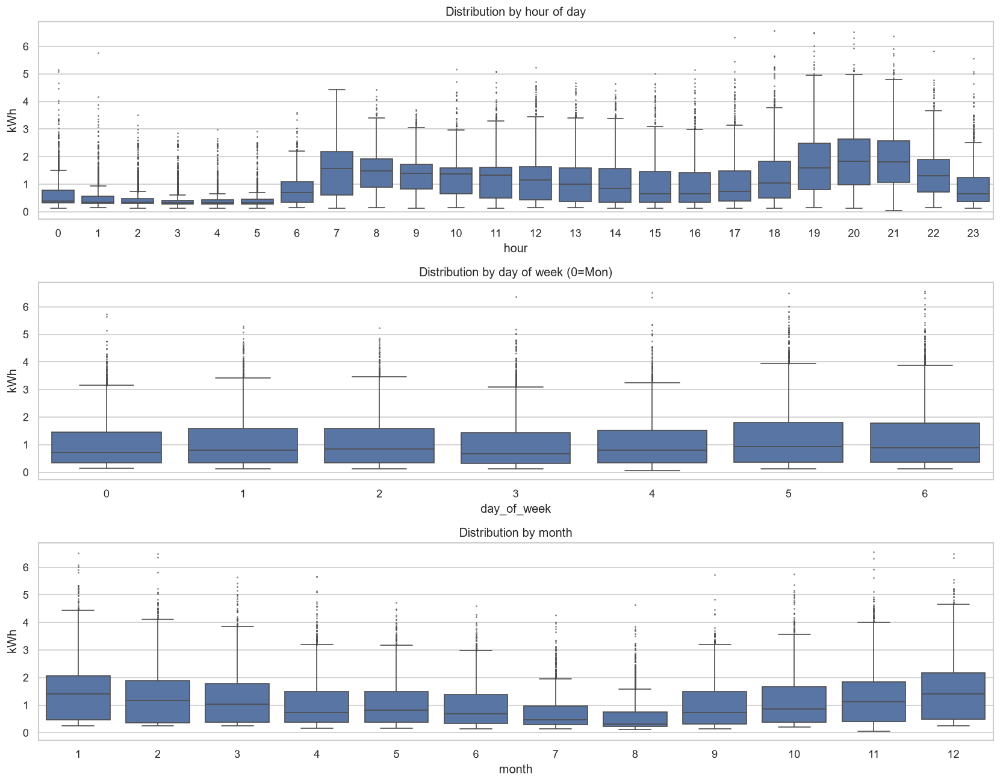
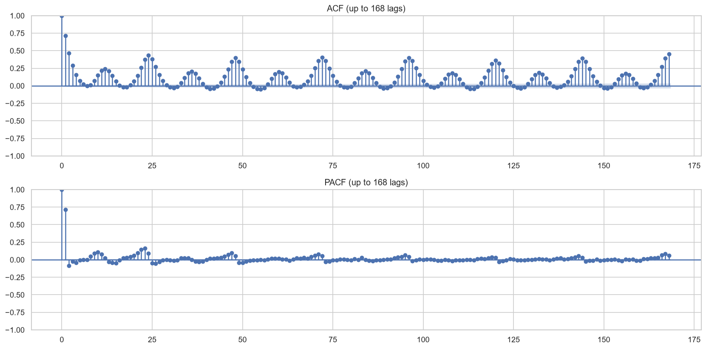

# Household Electricity Consumption Forecasting

**Short-horizon load forecasting on the UCI Individual Household Electric Power Consumption dataset.**

Author: Arturo Magdiel · 2026 · MIT License

---

## Table of contents

1. [Executive summary](#1-executive-summary)
2. [Introduction](#2-introduction)
3. [Dataset](#3-dataset)
4. [Methodology](#4-methodology)
5. [Modeling](#5-modeling)
6. [Analysis](#6-analysis)
7. [Conclusions](#7-conclusions)
8. [Appendices](#8-appendices)

---

## 1. Executive summary

This project forecasts a single household's electricity demand at two operational horizons — the next hour and the next day — and quantifies which modelling paradigm earns its complexity. The winning model is a gradient-boosted tree (XGBoost) trained on causal lag and calendar features.

- **Next-hour forecast (h=1):** MAE **0.334 kWh**, MASE **0.510** — roughly half the error of the day-ahead seasonal-naive reference.
- **Next-day forecast (h=24):** MAE **0.444 kWh**, MASE **0.678** — a direct 24-hour-ahead model that still comfortably beats its seasonal baseline.

The three project hypotheses are all supported by the data:

- **H1 (weekly seasonality) — supported.** Kruskal-Wallis on day-of-week is highly significant (H = 239.3, p < 1e-40); the daily factor is stronger still (H = 8842.5).
- **H2 (stationarity after seasonal differencing) — supported.** The raw series is not cleanly stationary; its lag-24 seasonal difference is stationary under both ADF and KPSS.
- **H3 (trees match or beat the LSTM) — supported.** XGBoost beats the LSTM in cross-validation (0.378 vs 0.415 MAE) and on the test set (0.334 vs 0.371), while fitting in seconds rather than minutes.

**Business takeaway:** for a univariate household load series, a well-engineered tree model delivers the best accuracy at the lowest operational cost. Most of the predictive signal lives in recent demand and the daily/weekly calendar, not in model sophistication — a result that favours cheap, interpretable, easily retrained models in production.

---

## 2. Introduction

Accurate short-horizon load forecasting underpins grid balancing, demand-response programmes and household-level cost optimisation. Even at the scale of a single home, next-hour and next-day forecasts drive decisions: when to shift flexible loads, how to size local storage, and how to price time-of-use tariffs. Errors are asymmetric and operationally expensive, so a forecast is only useful if it beats the trivial "same as last period" heuristics that operators fall back on.

This project answers three business questions:

1. Can we reliably forecast next-hour and next-day household electricity consumption?
2. What are the dominant temporal patterns (hourly, daily, weekly, seasonal)?
3. Which paradigm — SARIMA, gradient-boosted trees, or an LSTM — offers the best performance-to-complexity trade-off?

and tests three hypotheses:

- **H1:** Weekly seasonality is statistically significant.
- **H2:** The series is non-stationary in its raw form and stationary after seasonal differencing.
- **H3:** A tree-based model with lag features can match or outperform an LSTM on this univariate series.

The analysis follows a strict chronological protocol so that every reported number reflects genuine out-of-sample performance, not information that would be unavailable at forecast time.

---

## 3. Dataset

**Source.** UCI Machine Learning Repository — *Individual Household Electric Power Consumption* (Sceaux, France), licensed CC BY 4.0. The raw file holds **2,075,259** minute-level measurements spanning **December 2006 to November 2010**, with approximately **1.25%** missing values.

**Variable dictionary.**

| Variable | Description | Unit |
|---|---|---|
| Global_active_power | Household global active power (target) | kW (minute) → kWh (hour) |
| Global_reactive_power | Household global reactive power | kW |
| Voltage | Average voltage | V |
| Global_intensity | Household global current intensity | A |
| Sub_metering_1 | Kitchen (dishwasher, oven, microwave) | Wh |
| Sub_metering_2 | Laundry (washing machine, dryer, fridge, light) | Wh |
| Sub_metering_3 | Water heater and air conditioner | Wh |

**Resampling.** Minute samples are aggregated to **hourly** resolution — the operationally relevant granularity and one that suppresses minute-level sensor noise. Active and reactive power convert from kW-minute to energy (kWh, kVARh); voltage and intensity average; sub-metering channels sum. This yields **34,589 hourly rows**.

**Imputation.** Gaps up to 60 minutes are forward-filled — consumption rarely jumps within an hour, so carrying the last reading forward is defensible; longer gaps use time interpolation to avoid flat-lining an entire outage. After cleaning, the hourly series has zero residual missing values. The measured missing rate (1.2518%) matched the documented expectation, and there were no missing timestamps (the gaps are `?` markers within existing rows, not absent minutes).

The series shows a clear annual envelope — higher, more variable demand in winter — over a stable multi-year level.

---

## 4. Methodology

The work follows a 20-phase framework: problem definition, data loading with integrity checks, quality audit, cleaning and resampling, feature engineering, exploratory analysis, statistical testing, then modelling, cross-validation, tuning, evaluation, error analysis, interpretation, a dashboard, tests and CI, and finally reporting and deployment.

**Chronological split (no random split).** Train is December 2006 to December 2009 (**26,335 rows**, 2006-12-30 17:00 to 2009-12-31 23:00); test is January to November 2010 (**7,918 rows**, 2010-01-01 00:00 to 2010-11-26 21:00). A random split would place future observations in the training set and leak the very autocorrelation the model exploits — inflating scores and misrepresenting deployment behaviour. Time-series validity requires the training window to precede the test window.

**Cross-validation.** Model selection uses `TimeSeriesSplit` with an expanding window (5 folds), so each validation fold sits strictly after its training slice — the in-sample analogue of the train/test split. `KFold` is never used.

**Leakage-safe feature engineering.** The forecasting matrix contains **22 features**: calendar and cyclical encodings (hour, day-of-week, day, month, quarter, weekend flag, sin/cos of hour/day-of-week/month), a French public-holiday flag, and causal lags and rolling statistics of the target (lags 1, 24, 48, 168, 336; rolling mean/std over 24 h and 168 h, shifted so the current hour never enters its own window). Three exclusions are deliberate:

- **Contemporaneous meter channels are dropped** (Global_intensity, Global_reactive_power, Voltage, Sub_metering_1/2/3): they are unknown at forecast time, and Global_intensity is a near-linear proxy of the target — including it would leak the answer.
- **`year` is dropped** from the model matrix: train years (2006–2009) are disjoint from the test year (2010), and a tree cannot extrapolate an unseen category. It is retained for exploratory analysis only.
- **The first 336 warm-up rows are dropped**, since the longest lag (336 h) is undefined there.

**Metrics.** MAE is the primary metric (robust, in the target's own kWh units). RMSE, MAPE and sMAPE provide scale-free and outlier-sensitive views. MASE scales MAE by the in-sample lag-24 seasonal-naive error on the training set (**denominator = 0.6551**); lag-24 is the natural no-skill reference because the dominant cycle is daily, so a value below 1 means the model beats "same hour yesterday".

**Reproducibility.** Seed 42 throughout; Python 3.12 with pinned dependencies; experiments tracked in MLflow; a pytest suite runs on synthetic fixtures in GitHub Actions without ever downloading the real dataset.

---

## 5. Modeling

The roster spans three paradigms of increasing complexity:

- **Naive baselines** — persistence (lag-1), daily seasonal naive (lag-24), weekly seasonal naive (lag-168). These set the bar every other model must clear.
- **SARIMA** — `(1,0,1)(1,1,1,24)`. Orders are informed, not searched: `D=1, s=24` follows directly from H2 (stationary after lag-24 differencing); `d=0` because the raw level is already mean-reverting (ADF); `p=q=1` capture short-run intraday autocorrelation; `P=Q=1` model the daily seasonal structure. A full `s=24` fit on ~26k points is impractical, so the model is fit on the most recent ~90 days of training — contiguous with the test period — and forecast one step ahead via the Kalman filter. This window is a documented tractability trade-off.
- **XGBoost with lag features** — trees split on raw thresholds, so no scaling is applied. Early stopping uses a chronological tail of training, never a random fold.
- **LSTM** — two layers, hidden size 64, dropout 0.2, a 168-hour lookback mapping to the next hour. The target is standardised with a scaler fit on training data only; training uses Adam (lr 1e-3), batch 256, and early stopping (patience 3, best epoch 5, ~341 s on CPU). Predictions are inverse-transformed before scoring so MAE stays in kWh.

**Tuning.** XGBoost was tuned with a 20-iteration randomized search over eight hyperparameters using the same expanding-window CV. The gain was marginal — tuned CV MAE 0.3775 versus untuned 0.3780, and tuned test MAE 0.3338 versus 0.3345. The headline finding is that **features, not hyperparameters, drive performance** on this series. SARIMA orders were kept from ACF/PACF and H2; the LSTM architecture was fixed by design, since its role is to test H3 rather than to win.

**Next-day model.** The day-ahead forecast uses a **direct h=24 XGBoost**: the label is the target 24 hours ahead, features are the calendar of the predicted timestamp (known in advance) plus lags and rolling statistics known at the forecast origin. This alignment keeps the next-day forecast leakage-free.

---

## 6. Analysis

### Test leaderboard

All models scored on the held-out test set (January–November 2010) with the single `src/metrics.py` implementation. MAE is primary; horizon is labelled.

| Model | Horizon | MAE | RMSE | MAPE | sMAPE | MASE |
|---|---|---|---|---|---|---|
| **xgboost_tuned** | h=1 | **0.3338** | 0.4823 | 41.92 | 33.31 | 0.5095 |
| xgboost | h=1 | 0.3345 | 0.4829 | 41.84 | 33.32 | 0.5106 |
| sarima | h=1 | 0.3594 | 0.5087 | 46.98 | 36.22 | 0.5486 |
| lstm | h=1 | 0.3712 | 0.5197 | 49.34 | 37.62 | 0.5666 |
| naive_lag1 | h=1 | 0.3953 | 0.6101 | 44.04 | 36.57 | 0.6034 |
| naive_lag24 | h=1 | 0.5519 | 0.8139 | 68.16 | 49.45 | 0.8424 |
| naive_lag168 | h=1 | 0.5841 | 0.8343 | 75.71 | 54.04 | 0.8916 |
| xgboost_h24 | h=24 | 0.4444 | 0.6069 | 61.24 | 44.27 | 0.6784 |

Tuned XGBoost leads at h=1; the day-ahead model, though necessarily less accurate, still beats its lag-24 baseline (MASE 0.678 < 1). Among the naive baselines, lag-1 persistence is clearly the strongest (MAE 0.395 versus 0.552 and 0.584 for the daily and weekly seasonal naives): short-run autocorrelation is so strong at hourly resolution that the last observation is the single best no-model predictor — foreshadowing the dominance of `lag_1` in the feature importances.

### Cross-validation

Expanding-window CV on the training set confirms the ranking is not an artefact of the single test split.

| Model | CV MAE (mean ± std) | Notes |
|---|---|---|
| xgboost | 0.378 ± 0.035 | train-vs-CV gap 0.082 (mild overfit) |
| sarima | 0.393 ± 0.034 | recent-window refit per fold |
| lstm | 0.415 ± 0.047 | 3-fold (CPU cost) |
| naive_lag1 | 0.441 ± 0.039 | |
| naive_lag168 | 0.610 | |
| naive_lag24 | 0.634 | |

Note that the two weakest baselines swap order between the test set (lag-24 < lag-168) and cross-validation (lag-168 < lag-24). This is harmless: both are far behind every real model, and the ordering of two poor references carries no bearing on model selection.

### Actual versus predicted

The highest-demand full week in the test set (winter, week of 2010-02-08) stresses every model. The tree tracks the actual series most closely; SARIMA and the LSTM lag the sharp transitions.

### Residual diagnostics

Residuals for the winning model are approximately centred with heavier-than-normal tails (expected for a heavy-tailed load series), and little remaining autocorrelation at short lags.

### Error breakdown

Errors are not uniform. They concentrate at the evening peak (19:00–21:00, MAE ~0.51) and the morning ramp (07:00, where SARIMA is notably weaker, 0.59 vs 0.42), are higher on weekends than weekdays, and peak in winter (January/February ~0.40) while bottoming out in August (~0.20, low holiday-season demand).

### Feature importances

Recent demand dominates: `lag_1` (0.40), followed by the weekly lag `lag_168`, `hour`, the two-week lag `lag_336`, and the cyclical `hour_cos`. This explains both the accuracy and the failure modes — a model leaning on the last observation struggles precisely where demand ramps fastest.

### Seasonality and autocorrelation

The exploratory analysis corroborates the statistical tests: a dominant daily cycle, a weekly weekday/weekend contrast, and autocorrelation that stays significant far out.

---

## 7. Conclusions

### Business questions answered

- **Q1 — Can we forecast next-hour and next-day demand?** Yes. Next-hour tuned XGBoost achieves MAE 0.334 kWh (MASE 0.510); the direct next-day model achieves MAE 0.444 kWh (MASE 0.678). Both beat their seasonal-naive baselines.
- **Q2 — What are the dominant temporal patterns?** A dominant daily cycle (Kruskal-Wallis by hour H = 8842.5), a significant weekly cycle separating weekday from weekend routines (H = 239.3), and an annual component with a winter demand peak. Autocorrelation is significant out to at least 720 lags (Ljung-Box statistics 50757, 196057 and 593902 at lags 24, 168 and 720, all p < 1e-3; computed in `src/stats_tests.py` and reproduced in the executed `01_eda` notebook).
- **Q3 — Best paradigm versus complexity?** XGBoost wins on both axes: lowest error and lowest cost (seconds to fit, no scaling, CPU-friendly, trivially retrainable). SARIMA is a close second but requires a windowed refit; the LSTM is the most expensive and the weakest of the three. The accuracy-per-unit-complexity winner is the gradient-boosted tree.

### Hypotheses confirmed

- **H1 — supported.** Kruskal-Wallis on day-of-week: H = 239.3, p < 1e-40.
- **H2 — supported.** Raw series: ADF p ≈ 1e-26 (rejects a unit root) but KPSS p ≤ 0.01 (rejects stationarity) — not cleanly stationary. Lag-24 seasonal difference: ADF p ≈ 0 and KPSS p ≥ 0.10 — stationary under both.
- **H3 — supported.** XGBoost beats the LSTM in CV (0.378 vs 0.415) and on test (0.334 vs 0.371), at ~3 s versus ~341 s to fit.

### Business insights

The signal is concentrated in recent demand and the calendar, not in exotic model structure. In practice this means a lightweight, interpretable model can be deployed and retrained cheaply, with feature importances that a non-specialist can read. The error profile is actionable: forecasts are least reliable at the evening peak and on weekends, so any downstream decision (load shifting, storage dispatch) should widen its safety margin during those windows.

### Limitations

- SARIMA was fit on a reduced ~90-day recent window for tractability, not the full training history.
- LSTM cross-validation used 3 folds (versus 5 for the other models), so its CV figure is not perfectly comparable.
- The dataset is a single household; the model does not generalise to other homes without retraining.
- No weather or other exogenous regressors were used; temperature in particular would likely improve winter accuracy.
- The next-day forecast comes from a direct h=24 model only; recursive and multi-output alternatives were not compared.

### Production monitoring (Phase 20)

A deployed forecaster needs a monitoring loop, not just a trained artefact:

- **Data-drift detection.** Track the input feature distributions (lag/rolling summaries, hourly demand) against the training reference with a population-stability index or KS test; alert when drift crosses a threshold.
- **Performance monitoring.** Log rolling MAE and MASE on realised outcomes; a sustained MASE approaching 1 signals the model no longer beats the naive baseline.
- **Retraining triggers.** Retrain on a drift alert, on a MASE breach, or on a fixed cadence — a monthly scheduled retrain suits a slowly drifting household with seasonal regime changes, with an on-demand retrain reserved for step changes (new appliance, occupancy change).
- **Cadence.** Nightly batch scoring for the day-ahead horizon; the cheap fit cost (seconds) makes frequent retraining operationally trivial.

---

## 8. Appendices

### A. Variable dictionary

See Section 3. The modelling target is `Global_active_power` in kWh per hour.

### B. Model matrix (22 features)

`hour, dayofweek, day, month, quarter, is_weekend, hour_sin, hour_cos, dayofweek_sin, dayofweek_cos, month_sin, month_cos, lag_1, lag_24, lag_48, lag_168, lag_336, roll_mean_24, roll_std_24, roll_mean_168, roll_std_168, is_holiday`.

### C. Tuned XGBoost hyperparameters

| Parameter | Value |
|---|---|
| n_estimators | 221 |
| max_depth | 6 |
| learning_rate | 0.0357 |
| subsample | 0.810 |
| colsample_bytree | 0.673 |
| min_child_weight | 10 |
| reg_alpha | 0.0071 |
| reg_lambda | 1.092 |

Found via 20-iteration randomized search with expanding-window `TimeSeriesSplit`, scoring negative MAE, seed 42.

### D. Other model configurations

- **SARIMA:** `(1,0,1)(1,1,1,24)`, fit on the last ~90 days of training, one-step-ahead over test.
- **LSTM:** 2 layers, hidden size 64, dropout 0.2, 168-hour lookback → 1-hour output; StandardScaler fit on training only; Adam (lr 1e-3), batch 256, early stopping patience 3 (best epoch 5).

### E. Environment and reproducibility

- Python 3.12.10; dependencies pinned in `requirements.txt` / `dev-requirements.txt`.
- Global seed 42 (Python, NumPy, PyTorch).
- Experiment tracking: local MLflow store (`mlruns/`), experiment `household-power-forecasting`.
- Testing: pytest suite on synthetic fixtures; GitHub Actions CI runs the suite without the real dataset.

### F. MLflow run summary

The experiment logs one run per model (three naive baselines, SARIMA, LSTM, untuned and tuned XGBoost, the direct h=24 model), each with parameters, all five metrics, and prediction artifacts, plus per-model cross-validation runs.

### G. References

- Hebrail, G. and Berard, A. *Individual Household Electric Power Consumption*. UCI Machine Learning Repository. CC BY 4.0.
- Hyndman, R. J. and Athanasopoulos, G. *Forecasting: Principles and Practice*.
- Hyndman, R. J. and Koehler, A. B. (2006). *Another look at measures of forecast accuracy* (MASE).
